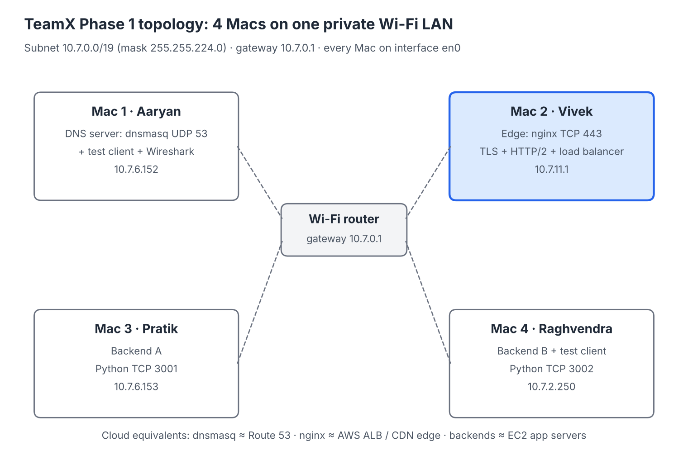
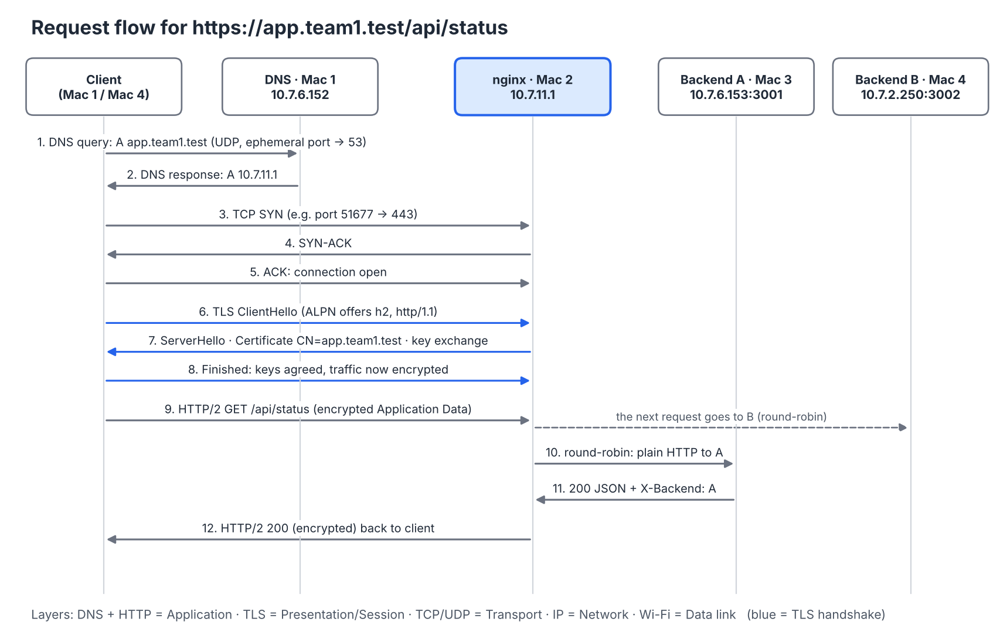
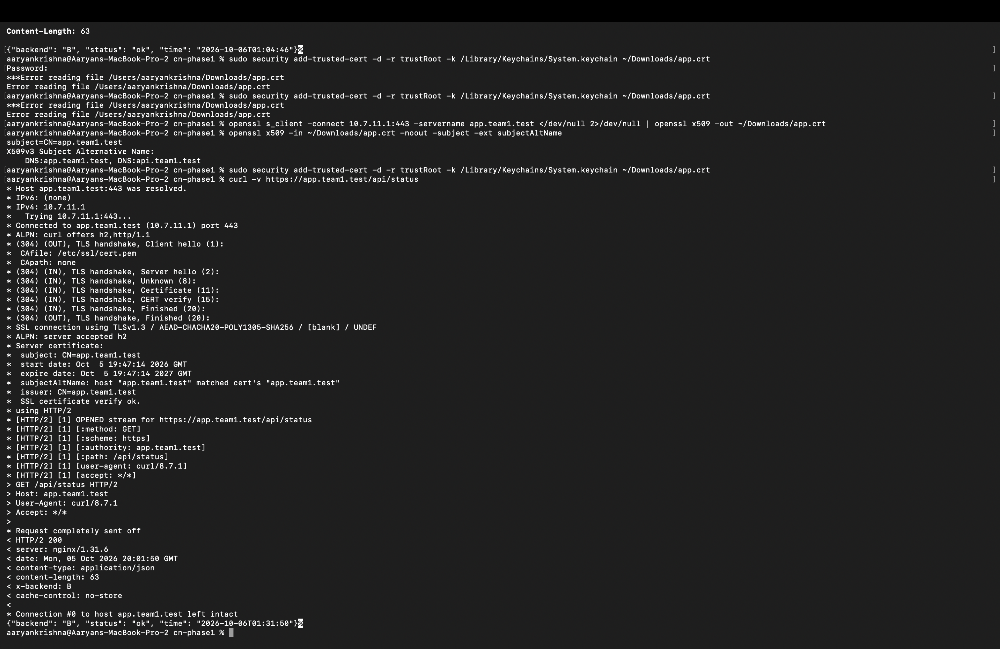
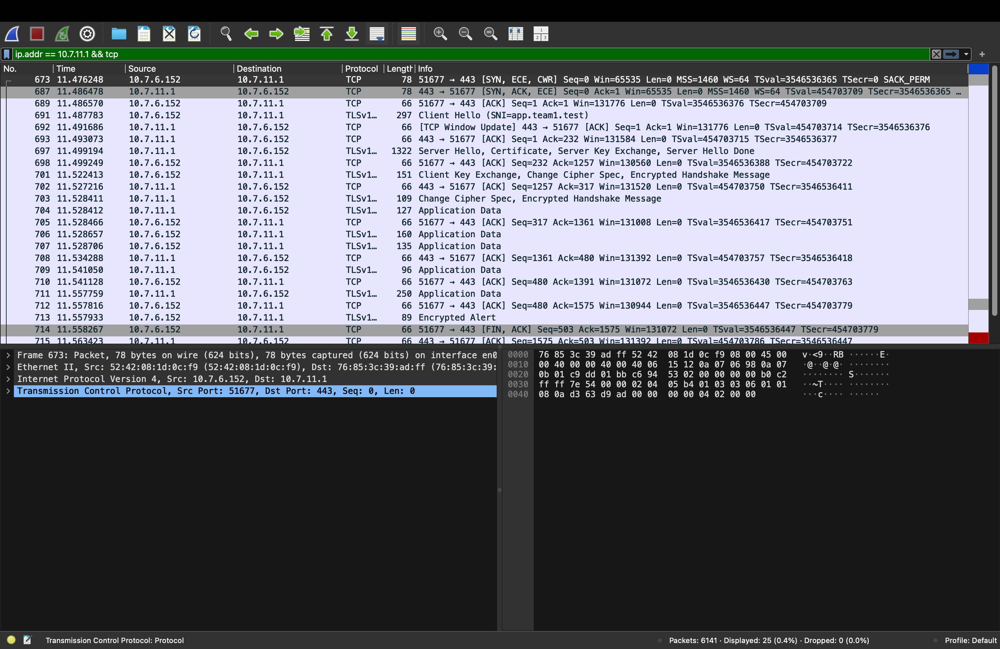
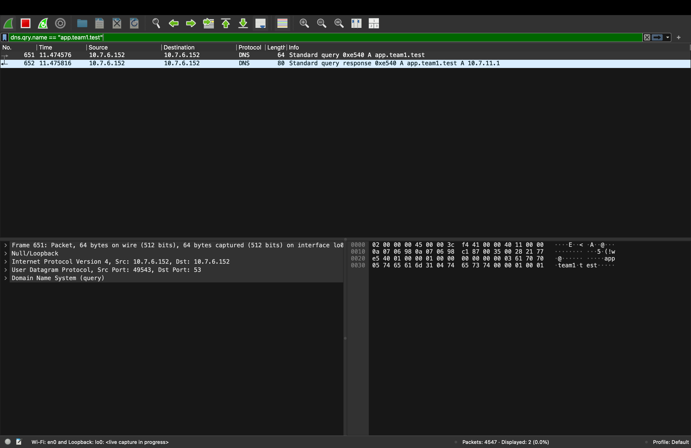
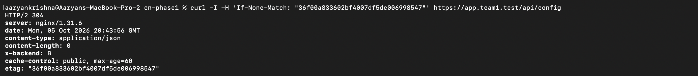
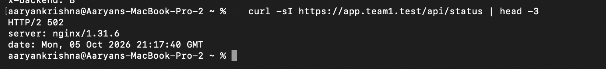

# CN Project – Private Network Service Platform (TeamX)

**Phase 1: Build & Observe** · Computer Networks course project

A private service running on 4 macOS laptops with no cloud. A client types `https://app.team1.test`,
resolves it through **our own DNS server**, connects over **HTTPS (TLS + HTTP/2)** to an **nginx edge**,
and is **load-balanced** across two backend servers.

Infrastructure: **Type 1 – 4 physical macOS laptops on the same LAN**

## Team Members

| Enrollment No. | Name | Machine | Role |
|---|---|---|---|
| 2401010010 | Aaryan Krishna | Mac 1 | Private DNS server (dnsmasq) + test client + Wireshark |
| 2401020077 | Vivek Kumar Raj | Mac 2 | Edge: nginx reverse proxy, TLS termination, load balancer |
| 2401010346 | Pratik Agade | Mac 3 | Backend A (Python, port 3001) |
| 2401010367 | Raghvendra Singh | Mac 4 | Backend B (Python, port 3002) + test client |

## Network Inventory

All Macs: Wi-Fi interface `en0`, subnet mask `255.255.224.0` (/19), default gateway `10.7.0.1`.

| Mac | Role | IPv4 | MAC address | Service : Port | Cloud equivalent |
|---|---|---|---|---|---|
| Mac 1 | DNS server + client | 10.7.6.152 | 52:42:08:1d:0c:f9 | dnsmasq : 53/UDP | AWS Route 53 |
| Mac 2 | Edge / LB / TLS | 10.7.11.1 | 76:85:3c:39:ad:ff | nginx : 443/TCP | AWS ALB / CDN edge |
| Mac 3 | Backend A | 10.7.6.153 | 36:54:43:32:84:34 | Python : 3001/TCP | App server (EC2) |
| Mac 4 | Backend B + client | 10.7.2.250 | 56:5f:9f:b9:59:8f | Python : 3002/TCP | App server (EC2) |

Private domain (reserved `.test` namespace): `app.team1.test`, `api.team1.test` → `10.7.11.1` (Mac 2).



## Request Flow

```
1. DNS      Client --UDP 53--> Mac 1 dnsmasq        "app.team1.test?" -> 10.7.11.1
2. TCP      Client --SYN/SYN-ACK/ACK--> Mac 2 :443
3. TLS      ClientHello -> ServerHello -> Certificate -> Key Exchange -> Finished (ALPN picks h2)
4. HTTP/2   Encrypted GET /api/status -> nginx (TLS terminated here)
5. Proxy    nginx --HTTP, round-robin--> Mac 3 :3001 (Backend A) or Mac 4 :3002 (Backend B)
6. Reply    JSON + X-Backend header travels back the same way
```



| OSI layer | In this project |
|---|---|
| 7 Application | DNS, HTTP/1.1, HTTP/2, REST API |
| 6/5 Presentation/Session | TLS 1.2 / 1.3 |
| 4 Transport | TCP (443, 3001, 3002), UDP (53), client ephemeral ports |
| 3 Network | IPv4 addresses 10.7.x.x |
| 2/1 Data link/Physical | Wi-Fi 802.11, MAC addresses |

## How to Run the Backends

Requires only **Python 3** (standard library – no packages to install).

```bash
# Mac 3 (Pratik)
python3 backend/backend.py A 3001

# Mac 4 (Raghvendra)
python3 backend/backend.py B 3002
```

The backends listen on `0.0.0.0` so other machines on the LAN can reach them.

| Endpoint | Response |
|---|---|
| `GET /` | JSON confirming the service is running |
| `GET /api/status` | `{"backend": "A", "status": "ok", ...}` with `Cache-Control: no-store` |
| `GET /api/config` | Caching demo: `Cache-Control: public, max-age=60` + `ETag`; returns **304** for a matching `If-None-Match` |
| every response | `X-Backend: A` or `X-Backend: B` header |

## DNS Server (Mac 1)

```bash
brew install dnsmasq
# append configs/dnsmasq.conf to /opt/homebrew/etc/dnsmasq.conf
sudo brew services start dnsmasq
```

Every Mac uses Mac 1 as its resolver:

```bash
networksetup -setdnsservers Wi-Fi 10.7.6.152
sudo dscacheutil -flushcache; sudo killall -HUP mDNSResponder
```

## Edge – nginx + TLS (Mac 2)

```bash
brew install nginx
# create the certificate: see configs/TLS-setup.md
cp configs/team1.conf /opt/homebrew/etc/nginx/servers/team1.conf
sudo nginx -t && sudo brew services start nginx
```

## Verification (from a client, by name, no `-k`)

```bash
dig app.team1.test                                     # -> 10.7.11.1, SERVER 10.7.6.152#53
curl -v https://app.team1.test/api/status              # TLS 1.3, cert verify ok, HTTP/2, X-Backend
for i in 1 2 3 4 5 6; do curl -s -D - https://app.team1.test/api/status -o /dev/null | grep -i x-backend; done
curl -sv --http1.1 https://app.team1.test/api/status 2>&1 | grep -E "ALPN|^< HTTP"
curl -sv --http2   https://app.team1.test/api/status 2>&1 | grep -E "ALPN|^< HTTP"
curl -I https://app.team1.test/api/config                                   # Cache-Control + ETag
curl -I -H 'If-None-Match: "<etag>"' https://app.team1.test/api/config       # -> 304
```

## Results

| Test | Result |
|---|---|
| Ping between all Macs | 0% packet loss |
| DNS from Mac 3 and Mac 4 (no `@server`) | `app.team1.test → 10.7.11.1`, answered by `10.7.6.152#53` |
| HTTPS by name | `TLSv1.3`, `SSL certificate verify ok`, no `-k`, padlock in browser |
| Protocol | ALPN `h2` → `HTTP/2 200`; `--http1.1` → `HTTP/1.1 200 OK` |
| Load balancing | `X-Backend: A, B, A, B, A, B` |
| Caching | `cache-control: public, max-age=60`, `etag: "36f00a83…"`, conditional request → `HTTP/2 304`, `content-length: 0` |
| Wireshark | DNS query/response on UDP 53, SYN/SYN-ACK/ACK to 443, ClientHello/ServerHello/Certificate, encrypted Application Data |

## Evidence

All screenshots are in [`evidence/`](evidence/) (index: [evidence/README.md](evidence/README.md)).

**Load balancing** (terminal output from Mac 1):
```
$ for i in 1 2 3 4 5 6; do curl -s -D - https://app.team1.test/api/status -o /dev/null | grep -i x-backend; done
x-backend: A
x-backend: B
x-backend: A
x-backend: B
x-backend: A
x-backend: B
```

**HTTPS by name, TLS 1.3, HTTP/2, no `-k`**



**Full TCP + TLS exchange in Wireshark** (SYN → SYN-ACK → ACK → Client Hello → Server Hello/Certificate → encrypted Application Data → FIN)



**DNS query and response (UDP 53)**



**Caching: conditional request returns 304**



**Both backends down → 502 from the edge**



## Failure Demonstrations

| # | Failure | How | Observation | What it proves |
|---|---|---|---|---|
| 1 | Wrong DNS server | client DNS → 8.8.8.8 | `NXDOMAIN`, curl "Could not resolve host", but `ping 10.7.11.1` works | DNS and IP connectivity are independent |
| 2 | DNS record → wrong IP | record set to 10.7.11.99 | dig returns 10.7.11.99, curl times out | DNS is a directory, not a connection |
| 3 | Backend A stopped | Ctrl+C on Mac 3 | every response `X-Backend: B` | nginx routes around a failed backend |
| 4 | Both backends stopped | Ctrl+C on Mac 3 and 4 | `HTTP/2 502` from nginx | DNS + TLS work; fault is behind the edge |
| 5 | Wrong port | `https://app.team1.test:9999` | "Connection refused", ping still works | IP selects the host, port selects the service |

## Problems We Hit (and How We Diagnosed Them)

- **Backend unreachable from one Mac only** – nginx (Mac 2) timed out to Backend A while Mac 1 could reach it.
  Checked layer by layer: `ping` (IP OK) → `curl` direct to port 3001 (TCP) → nginx `error.log`.
- **Flaky college Wi-Fi** – pings up to ~900 ms and laptops' Wi-Fi power-saving caused occasional connect timeouts.
  nginx marked a backend down after a single failure, so we raised `max_fails` to 3 and `proxy_connect_timeout` to 10 s,
  and kept the laptops awake (`caffeinate`).
- **504 vs 502** – 504 Gateway Time-out = nginx waited and no backend answered; 502 Bad Gateway = connections refused
  (both backends stopped).
- **Managed (college) Macs** – firewall settings are locked on some laptops, which matters when choosing which Mac hosts a service.
- **Mac 1 DNS traffic is on loopback** – Mac 1 is its own resolver, so its DNS packets appear on `lo0`, while HTTPS traffic to Mac 2 appears on `en0`.

## Repository Layout

```
backend/backend.py      backend A and B (same code, different arguments)
configs/dnsmasq.conf    DNS records (Mac 1)
configs/team1.conf      nginx reverse proxy + load balancer + TLS (Mac 2)
configs/TLS-setup.md    certificate creation and trust steps
docs/                   topology and request-flow diagrams
evidence/               screenshots and Wireshark capture, named by task
```

The private key (`app.key`) is intentionally **not** in this repository.
